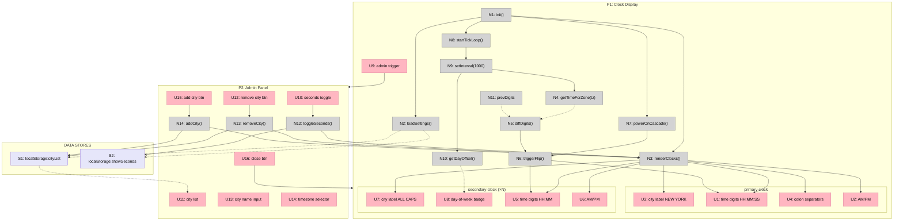
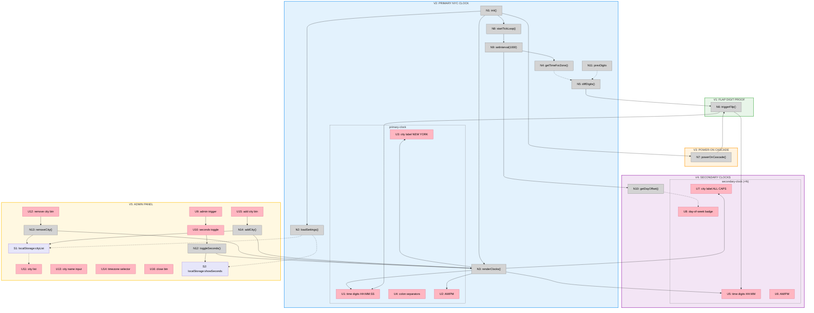

# Tock — Big Picture

**Selected shape:** A (Split-Flap Clock App — Configurable Cities, Pure CSS/JS)

---

## Frame

### Problem

- Need to quickly check what time it is for co-workers in multiple time zones before connecting with them
- No at-a-glance tool that shows NYC (primary) alongside Nashville, LA, Auckland, and Tel Aviv

### Outcome

- Open a page and immediately see NYC time prominently, with secondary city clocks below
- All clocks stay current in real-time
- The interface feels like a physical split-flap display — not a cartoon imitation

---

## Shape

### Fit Check (R × A)

| Req | Requirement | Status | A |
|-----|-------------|--------|---|
| R0 | NYC time displayed prominently as the primary clock | Core goal | ✅ |
| R1 | Secondary clocks for configurable cities visible below primary (default: Nashville, Los Angeles, Auckland, Tel Aviv) | Core goal | ✅ |
| R2 | All clocks update in real-time — stay current to the second | Must-have | ✅ |
| R3 | Dark theme throughout | Must-have | ✅ |
| R4 | Split-flap / flip-board animation aesthetic (airport terminal style) | Must-have | ✅ |
| R5 | Flip animation uses physically accurate motion: gravity-driven hinge, acceleration, overshoot, snap settle | Must-have | ✅ |
| R6 | Seconds display on primary clock can be toggled off via admin area | Must-have | ✅ |
| R7 | Admin area is hidden from the main clock view — does not disrupt the display | Must-have | ✅ |
| R8 | Fast to load — minimal dependencies, quick to first render | Must-have | ✅ |
| R9 | Can add new city/timezone from admin area | Must-have | ✅ |
| R10 | Can remove a city/timezone from admin area | Must-have | ✅ |
| R11 | City list persists across page reloads (localStorage) | Must-have | ✅ |
| R12 | No more than ~6 secondary locations expected at a time | Nice-to-have | ✅ |
| R13 | 12-hour format with AM/PM indicator | Must-have | ✅ |
| R14 | Day-of-week shown for cities where the date differs from NYC (e.g., Auckland showing "TUE") | Must-have | ✅ |
| R15 | City labels displayed in ALL CAPS | Must-have | ✅ |
| R16 | Power-on cascade animation on page load/refresh — flaps flip into place as if the board is starting up | Must-have | ✅ |
| R17 | AM/PM label color gradient — hour-based warm/cool tones per location. Daytime (6–17): gold→amber→rust. Nighttime (18–5): blue→navy→indigo. | Must-have | ✅ |

### Parts

| Part | Mechanism | Flag |
|------|-----------|:----:|
| **A1** | **Flap digit** — four-layer DOM per character. Top flap rotates `0° → -90°` with `ease-in` (gravity). Bottom flap rotates `90° → 0°` via multi-stage keyframes: overshoot -3°, bounce-back 1.5°, settle. `perspective: 300–500px`, `backface-visibility: hidden`. Hinge gap + cast shadow. ~300ms duration. | |
| **A2** | **Clock assembly** — groups flap digits into `HH : MM (: SS)` in 12-hour format. AM/PM indicator as smaller flap pair. `Intl.DateTimeFormat` with `hour12: true`. Only flips digits that changed. | |
| **A3** | **Primary NYC display** — large clock assembly (`America/New_York`), "NEW YORK" label in ALL CAPS. | |
| **A4** | **Secondary clocks row** — smaller assemblies from dynamic city list. ALL CAPS labels. Day-of-week badge when date differs from NYC. Defaults: Nashville, LA, Auckland, Tel Aviv. Reads from localStorage. | |
| **A5** | **Tick loop** — single `setInterval(1000)` drives all assemblies. Diffs digits, triggers flaps on change only. | |
| **A6** | **Dark shell** — dark background, terminal font, centered layout. Responsive stacking on narrow screens. | |
| **A7** | **Admin panel** — hidden drawer via gear icon. Seconds toggle, city list with remove, add-city input with timezone selector. Persists to localStorage. | |
| **A8** | **Power-on cascade** — on load, all digits flip from blank to current values with staggered 30–80ms delays. Primary first, then secondary. |
| **A9** | **Period color gradient** — `PERIOD_COLORS[0..23]` maps each hour to a hex color. `getHour24ForZone(tz)` + `applyPeriodColor(periodEl, tz)` sets inline color on AM/PM labels. Warm tones for day (6–17), cool tones for night (18–5). | |

### Breadboard

**Legend:**
- **Pink nodes (U)** = UI affordances (things users see/interact with)
- **Grey nodes (N)** = Code affordances (methods, stores, timers)
- **Lavender nodes (S)** = Data stores (localStorage)
- **Solid lines** = Wires Out (calls, triggers, writes)
- **Dashed lines** = Returns To (reads, return values)

---

## Slices

### Sliced Breadboard

### Slices Grid

|  |  |  |
|:--|:--|:--|
| **V1: FLAP DIGIT PROOF** ✅ DONE  • Four-layer DOM structure • CSS 3D `@keyframes` with physics • Gravity ease-in, overshoot, bounce settle • Hinge gap + cast shadow  *Demo: Single digit flips with Solari-accurate physics* | **V2: PRIMARY NYC CLOCK** ✅ DONE  • Clock assembly HH:MM:SS • 12h format + AM/PM flaps • `Intl.DateTimeFormat` tick loop • Diff digits, flip only changes  *Demo: NYC clock shows real time, digits flip each second* | **V3: POWER-ON CASCADE** ✅ DONE  • Digits start blank on load • Staggered flip 30–80ms offsets • Left-to-right, primary first • • &nbsp;  *Demo: Refresh — digits rattle into place like a board powering on* |
| **V4: SECONDARY CLOCKS** ✅ DONE  • 4 smaller clock assemblies • ALL CAPS city labels • Day-of-week badge (date differs from NYC) • Hardcoded default cities  *Demo: NYC large + 4 cities below, Auckland shows "TUE"* | **V5: ADMIN PANEL** ✅ DONE  • Hidden gear-icon drawer • Seconds toggle for primary clock • Add/remove cities • localStorage persistence  *Demo: Toggle seconds, add London, remove Nashville, refresh — persists* | **V6: PERIOD COLOR GRADIENT** ✅ DONE  • 24-hour color mapping array • Daytime: gold→amber→rust • Nighttime: blue→navy→indigo • Per-location based on local hour  *Demo: NYC warm amber PM, Auckland cool lavender AM — visible simultaneously* |
