# Tock — Shaping

## Source

> I want to build a simple clock web app that shows me the local time in NYC primarily. Below that clock I want several other clocks of the same style for different cities/time zones (Nashville, TN; Los Angeles, CA; Auckland, New Zealand; Tel Aviv, Israel). They should stay current on time, be quick to load and reference those time zones at a glance so I know what time it is for co-workers before I call them. I would like the theme to be dark. I would like the time to flip like an old school airport terminal board. It should have a control to turn the seconds display on the large clock off, but subtly out of the way as to not ruin the interface design. Take note in your execution of the animation detail as the board numbers flip - want to apply the proper physics to replicate the true behavior of this style system IRL.

---

## Frame

### Problem

- Need to quickly check what time it is for co-workers in multiple time zones before connecting with them
- No at-a-glance tool that shows NYC (primary) alongside Nashville, LA, Auckland, and Tel Aviv

### Outcome

- Open a page and immediately see NYC time prominently, with secondary city clocks below
- All clocks stay current in real-time
- The interface feels like a physical split-flap display — not a cartoon imitation

---

## Requirements (R)

| ID | Requirement | Status |
|----|-------------|--------|
| R0 | NYC time displayed prominently as the primary clock | Core goal |
| R1 | Secondary clocks for configurable cities visible below primary (default: Nashville, Los Angeles, Auckland, Tel Aviv) | Core goal |
| R2 | All clocks update in real-time — stay current to the second | Must-have |
| R3 | Dark theme throughout | Must-have |
| R4 | Split-flap / flip-board animation aesthetic (airport terminal style) | Must-have |
| R5 | Flip animation uses physically accurate motion: gravity-driven hinge, acceleration, overshoot, snap settle | Must-have |
| R6 | Seconds display on primary clock can be toggled off via admin area | Must-have |
| R7 | Admin area is hidden from the main clock view — does not disrupt the display | Must-have |
| R8 | Fast to load — minimal dependencies, quick to first render | Must-have |
| R9 | Can add new city/timezone from admin area | Must-have |
| R10 | Can remove a city/timezone from admin area | Must-have |
| R11 | City list persists across page reloads (localStorage) | Must-have |
| R12 | No more than ~6 secondary locations expected at a time | Nice-to-have |
| R13 | 🟡 12-hour format with AM/PM indicator | Must-have |
| R14 | 🟡 Day-of-week shown for cities where the date differs from NYC (e.g., Auckland showing "TUE") | Must-have |
| R15 | 🟡 City labels displayed in ALL CAPS | Must-have |
| R16 | 🟡 Power-on cascade animation on page load/refresh — flaps flip into place as if the board is starting up | Must-have |
| R17 | 🟡 AM/PM label color gradient — each hour of the 24-hour day maps to a unique color. Daytime (6 AM–5:59 PM): warm tones from soft gold through amber to muted rust. Nighttime (6 PM–5:59 AM): cool tones from slate blue through navy to soft indigo. Applied per-location based on local time. | Must-have |

---

## A: Split-Flap Clock App (Configurable Cities, Pure CSS/JS)

🟡 Single HTML/CSS/JS app. No framework. Configurable city list stored in localStorage. Split-flap animation built from CSS 3D transforms with physics-tuned easing. Timezone math via `Intl.DateTimeFormat`. Hidden admin panel for managing cities and settings.

| Part | Mechanism | Flag |
|------|-----------|:----:|
| **A1** | 🟡 **Flap digit** — four-layer DOM per character: two static halves (new char top, old char bottom) + two animated flaps. Top flap (old char top half) hinges at bottom edge (`transform-origin: 50% 100%`), rotates `0° → -90°` with `ease-in` timing (gravity acceleration). Bottom flap (new char bottom half) hinges at top edge (`transform-origin: 50% 0%`), rotates `90° → 0°` via multi-stage `@keyframes`: 70% → overshoot -3°, 85% → bounce-back 1.5°, 100% → settle at 0°. Container has `perspective: 300–500px`. Both flaps use `backface-visibility: hidden`. Hinge gap is 2px dark line. Cast shadow animates on bottom-static during flip. Duration ~300ms, bottom flap delayed 40–50%. See `spike-flip-physics.md`. | |
| **A2** | 🟡 **Clock assembly** — groups flap digits into `HH : MM (: SS)` in 12-hour format. AM/PM indicator rendered as a smaller flap pair or static label beside the time. Colon separators styled as fixed flap cards. Each assembly takes a `timeZone` string (IANA) and a `showSeconds` boolean. Uses `Intl.DateTimeFormat` with `hour12: true` and `timeZone` option to derive current h/m/s/period. Registers a tick callback (see A5) that updates only the digits that changed. | |
| **A3** | 🟡 **Primary NYC display** — large clock assembly (`timeZone: 'America/New_York'`), city label "NEW YORK" in ALL CAPS above or below in a terminal-style font. | |
| **A4** | 🟡 **Secondary clocks row** — smaller clock assemblies in a row/grid below primary, rendered from a dynamic city list. Each shows ALL CAPS city label + time (no seconds). Cities whose current date differs from NYC show a day-of-week abbreviation (e.g., "TUE") next to the city label. Day offset computed by comparing `Intl.DateTimeFormat` weekday for the city vs NYC each tick. Default cities: Nashville `America/Chicago`, Los Angeles `America/Los_Angeles`, Auckland `Pacific/Auckland`, Tel Aviv `Asia/Jerusalem`. List is read from localStorage on load; falls back to defaults if empty. | |
| **A5** | **Tick loop** — single `setInterval(1000)` drives all clock assemblies. Each tick, every assembly reads current time for its timezone via `Intl.DateTimeFormat`, diffs against previous digits, and triggers flap animations only on changed digits. No per-clock timers. | |
| **A6** | **Dark shell** — dark background (`#1a1a1a` or similar), minimal page chrome, monospace/terminal font (e.g., system mono or a web-safe equivalent to keep load fast). Layout: primary clock centered top, secondary clocks row centered below with even spacing. Responsive: stacks vertically on narrow screens. | |
| **A7** | **Admin panel** — hidden drawer/overlay toggled by a subtle trigger (e.g., gear icon in corner, or tap a hidden hotspot). Contains: (1) seconds toggle for primary clock, (2) city list with remove buttons, (3) add-city input (city name + IANA timezone picker or autocomplete). Changes persist to localStorage immediately. Panel slides in/out without disrupting clock layout. | |
| **A8** | 🟡 **Power-on cascade** — on page load/refresh, all flap digits start blank and flip into their current values with a staggered delay (left-to-right, primary clock first, then secondary clocks). Each digit triggers its flip animation with a 30–80ms offset from the previous, simulating a Solari board powering on. Runs once on init, then normal tick loop takes over. | |
| **A9** | 🟡 **Period color gradient** — `PERIOD_COLORS` array maps each of 24 hours to a hex color. `getHour24ForZone(tz)` extracts 24-hour value via `Intl.DateTimeFormat`. `getPeriodColor(hour24)` returns the mapped color. `applyPeriodColor(periodEl, tz)` sets inline `style.color` on the AM/PM label. Daytime hours (6–17) use warm gold→amber→rust. Nighttime hours (18–5) use slate blue→navy→indigo. Applied on init, on settings change, and each tick. | |

---

## Fit Check (R × A)

| Req | Requirement | Status | A |
|-----|-------------|--------|---|
| R0 | NYC time displayed prominently as the primary clock | Core goal | ✅ |
| R1 | Secondary clocks for configurable cities visible below primary (default: Nashville, Los Angeles, Auckland, Tel Aviv) | Core goal | ✅ |
| R2 | All clocks update in real-time — stay current to the second | Must-have | ✅ |
| R3 | Dark theme throughout | Must-have | ✅ |
| R4 | Split-flap / flip-board animation aesthetic (airport terminal style) | Must-have | ✅ |
| R5 | Flip animation uses physically accurate motion: gravity-driven hinge, acceleration, overshoot, snap settle | Must-have | ✅ |
| R6 | Seconds display on primary clock can be toggled off via admin area | Must-have | ✅ |
| R7 | Admin area is hidden from the main clock view — does not disrupt the display | Must-have | ✅ |
| R8 | Fast to load — minimal dependencies, quick to first render | Must-have | ✅ |
| R9 | Can add new city/timezone from admin area | Must-have | ✅ |
| R10 | Can remove a city/timezone from admin area | Must-have | ✅ |
| R11 | City list persists across page reloads (localStorage) | Must-have | ✅ |
| R12 | No more than ~6 secondary locations expected at a time | Nice-to-have | ✅ |
| R13 | 🟡 12-hour format with AM/PM indicator | Must-have | ✅ |
| R14 | 🟡 Day-of-week shown for cities where the date differs from NYC (e.g., Auckland showing "TUE") | Must-have | ✅ |
| R15 | 🟡 City labels displayed in ALL CAPS | Must-have | ✅ |
| R16 | 🟡 Power-on cascade animation on page load/refresh — flaps flip into place as if the board is starting up | Must-have | ✅ |
| R17 | 🟡 AM/PM label color gradient — hour-based warm/cool tones per location | Must-have | ✅ |

**Notes:**
- R5 resolved via A1 spike. See `spike-flip-physics.md`.
- R6, R7, R9, R10 satisfied by A7 (admin panel).
- R11 satisfied by A4 reading from localStorage + A7 writing to it.
- R12 is a soft constraint — layout in A4 handles up to ~6 naturally in a row/grid.
- 🟡 R13 satisfied by A2 (clock assembly uses `hour12: true`, renders AM/PM flap pair).
- 🟡 R14 satisfied by A4 (compares weekday of city vs NYC, shows day abbreviation when different).
- 🟡 R15 satisfied by A3 and A4 (ALL CAPS city labels).
- 🟡 R16 satisfied by A8 (power-on cascade with staggered flap init).
- 🟡 R17 satisfied by A9 (period color gradient — `PERIOD_COLORS` + `applyPeriodColor()` wired into init, settings change, and tick loop).

---

## Coverage Check (A × R)

Parts as rows, requirements as columns. Shows which parts satisfy which requirements.

| Part | R0 | R1 | R2 | R3 | R4 | R5 | R6 | R7 | R8 | R9 | R10 | R11 | R12 | R13 | R14 | R15 | R16 | R17 |
|------|:-:|:-:|:-:|:-:|:-:|:-:|:-:|:-:|:-:|:-:|:-:|:-:|:-:|:-:|:-:|:-:|:-:|:-:|
| **A1** Flap digit | | | | | ✅ | ✅ | | | | | | | | | | | | |
| **A2** Clock assembly | | | ✅ | | ✅ | | | | | | | | | ✅ | | | | |
| **A3** Primary NYC | ✅ | | | | | | | | | | | | | | | ✅ | | |
| **A4** Secondary row | | ✅ | | | | | | | | | | ✅ | ✅ | | ✅ | ✅ | | |
| **A5** Tick loop | | | ✅ | | | | | | ✅ | | | | | | | | | |
| **A6** Dark shell | | | | ✅ | | | | | ✅ | | | | | | | | | |
| **A7** Admin panel | | | | | | | ✅ | ✅ | | ✅ | ✅ | ✅ | | | | | | |
| **A8** Power-on cascade | | | | | ✅ | | | | | | | | | | | | ✅ | |
| **A9** Period color gradient | | | | | | | | | | | | | | | | | | ✅ |

---

## Detail A: Breadboard

### Places

| # | Place | Description |
|---|-------|-------------|
| P1 | Clock Display | Main view — primary NYC clock centered top, secondary city clocks below |
| P2 | Admin Panel | Hidden overlay/drawer — seconds toggle, city management |

### UI Affordances

| # | Place | Component | Affordance | Control | Wires Out | Returns To |
|---|-------|-----------|------------|---------|-----------|------------|
| U1 | P1 | primary-clock | time digits (HH:MM:SS) | render | — | — |
| U2 | P1 | primary-clock | AM/PM flap pair | render | — | — |
| U3 | P1 | primary-clock | city label "NEW YORK" | render | — | — |
| U4 | P1 | primary-clock | colon separators | render | — | — |
| U5 | P1 | secondary-clock | time digits (HH:MM) | render | — | — |
| U6 | P1 | secondary-clock | AM/PM flap pair | render | — | — |
| U7 | P1 | secondary-clock | city label (ALL CAPS) | render | — | — |
| U8 | P1 | secondary-clock | day-of-week badge (e.g., "TUE") | render | — | — |
| U9 | P1 | shell | admin trigger (gear icon, corner) | click | → P2 | — |
| U10 | P2 | admin-panel | seconds toggle switch | click | → N12 | — |
| U11 | P2 | admin-panel | city list (existing cities) | render | — | — |
| U12 | P2 | admin-panel | remove city button (per row) | click | → N13 | — |
| U13 | P2 | admin-panel | city name input | type | — | — |
| U14 | P2 | admin-panel | timezone selector | select | — | — |
| U15 | P2 | admin-panel | add city button | click | → N14 | — |
| U16 | P2 | admin-panel | close button | click | → P1 | — |

### Code Affordances

| # | Place | Component | Affordance | Control | Wires Out | Returns To |
|---|-------|-----------|------------|---------|-----------|------------|
| N1 | P1 | app | `init()` | call | → N2, → N3, → N7, → N8 | — |
| N2 | P1 | app | `loadSettings()` | call | — | → S1, → S2 |
| N3 | P1 | app | `renderClocks()` | call | → U1, → U2, → U3, → U4, → U5, → U6, → U7 | — |
| N4 | P1 | clock-assembly | `getTimeForZone(tz)` | call | — | → N5 |
| N5 | P1 | clock-assembly | `diffDigits(prev, current)` | call | → N6 | — |
| N6 | P1 | flap-digit | `triggerFlip(el, old, new)` | call | → U1, → U5 | — |
| N7 | P1 | app | `powerOnCascade()` | call | → N6 | — |
| N8 | P1 | app | `startTickLoop()` | call | → N9 | — |
| N9 | P1 | tick-loop | `setInterval(1000)` | timer | → N4, → N10 | — |
| N10 | P1 | secondary-clock | `getDayOffset(cityTz)` | call | — | → U8 |
| N11 | P1 | clock-assembly | `prevDigits` | store | — | → N5 |
| N12 | P2 | admin-panel | `toggleSeconds(bool)` | call | → S2, → N3 | — |
| N13 | P2 | admin-panel | `removeCity(index)` | call | → S1, → N3 | — |
| N14 | P2 | admin-panel | `addCity(name, tz)` | call | → S1, → N3 | — |

### Data Stores

| # | Place | Store | Description |
|---|-------|-------|-------------|
| S1 | P1 | `localStorage:cityList` | Array of `{name, timezone}` — persists across reloads. Defaults: Nashville, LA, Auckland, Tel Aviv |
| S2 | P1 | `localStorage:showSeconds` | Boolean — persists across reloads. Default: true |

### Wiring Narrative

**Init flow (page load):**
N1 `init()` → N2 `loadSettings()` reads S1 + S2 → N3 `renderClocks()` builds DOM for primary + all secondary clocks → N7 `powerOnCascade()` stagger-flips all digits from blank with 30–80ms offsets → N8 `startTickLoop()` begins the interval.

**Tick flow (every second):**
N9 `setInterval` fires → for each clock: N4 `getTimeForZone(tz)` returns `{h, m, s, period, weekday}` → N5 `diffDigits()` compares against N11 `prevDigits` → for each changed digit: N6 `triggerFlip()` runs CSS animation → updates U1 or U5. For secondary clocks: N10 `getDayOffset()` compares city weekday vs NYC → updates U8 if different.

**Admin — toggle seconds:**
U10 click → N12 `toggleSeconds()` → writes S2, calls N3 `renderClocks()` to show/hide seconds flaps on primary.

**Admin — remove city:**
U12 click → N13 `removeCity()` → writes S1, calls N3 `renderClocks()` to rebuild secondary row.

**Admin — add city:**
U13 type name, U14 select timezone, U15 click → N14 `addCity()` → writes S1, calls N3 `renderClocks()` to rebuild secondary row.

### Breadboard Diagram

**Legend:**
- **Pink nodes (U)** = UI affordances (things users see/interact with)
- **Grey nodes (N)** = Code affordances (methods, stores, timers)
- **Lavender nodes (S)** = Data stores (localStorage)
- **Solid lines** = Wires Out (calls, triggers, writes)
- **Dashed lines** = Returns To (reads, return values)

---

## Slices

Strategy: **prove the hard parts first** — the split-flap animation and real-time clock rendering. Then layer on secondary clocks, power-on polish, and finally the admin controls.

### Slice Summary

| # | Slice | Parts | Affordances | Demo |
|---|-------|-------|-------------|------|
| V1 | Flap digit proof | A1, A6 | N6, dark shell CSS | Single digit flips from 0→1 with physics animation — overshoot, bounce, settle |
| V2 | Primary NYC clock | A2, A3, A5 | U1–U4, N1–N5, N8–N9, N11 | Full NYC clock shows real time in 12h, digits flip each second, dark theme |
| V3 | Power-on cascade | A8 | N7 | Refresh page — digits cascade from blank into current time with staggered delays |
| V4 | Secondary clocks | A4 | U5–U8, N10, S1 (read-only defaults) | Four smaller clocks below NYC, Auckland shows "TUE" when date differs |
| V5 | Admin panel | A7 | U9–U16, N12–N14, S1, S2 | Open admin, toggle seconds, add/remove cities, refresh — everything persists |
| V6 | Period color gradient | A9 | N15–N18 | AM/PM labels show warm gold tones during day, cool blue/indigo at night — per location |

### Slice Details

**V1: Flap digit proof** — *Validate the animation before wiring anything else*

The riskiest piece. Build one flap digit cell with the four-layer DOM structure and CSS `@keyframes`. Wire a simple timer to cycle it through 0–9. Get the physics right: `ease-in` on the top flap, overshoot/bounce keyframes on the bottom flap, cast shadow, hinge gap. Dark background so we're seeing it in context.

| # | Affordance | Control | Wires Out |
|---|------------|---------|-----------|
| N6 | `triggerFlip(el, old, new)` | call | → CSS animation |

*Demo: A single digit flips through numbers. Top flap falls with gravity, bottom flap snaps down with overshoot and settle. Looks and feels like a real Solari card.*

---

**V2: Primary NYC clock** — *Wire real time to the proven animation*

Build the clock assembly: group 6–7 flap digits into `HH : MM : SS` with colon separators and AM/PM. Wire `Intl.DateTimeFormat` with `America/New_York` and `hour12: true`. Start the tick loop. Diff digits each tick, only flip what changed. Add the "NEW YORK" label. Dark shell layout.

| # | Affordance | Control | Wires Out | Returns To |
|---|------------|---------|-----------|------------|
| U1 | time digits (HH:MM:SS) | render | — | — |
| U2 | AM/PM flap pair | render | — | — |
| U3 | city label "NEW YORK" | render | — | — |
| U4 | colon separators | render | — | — |
| N1 | `init()` | call | → N2, → N3, → N8 | — |
| N2 | `loadSettings()` | call | — | → S2 |
| N3 | `renderClocks()` | call | → U1–U4 | — |
| N4 | `getTimeForZone(tz)` | call | — | → N5 |
| N5 | `diffDigits(prev, current)` | call | → N6 | — |
| N8 | `startTickLoop()` | call | → N9 | — |
| N9 | `setInterval(1000)` | timer | → N4 | — |
| N11 | `prevDigits` | store | — | → N5 |

*Demo: Full NYC clock centered on dark background. Real time in 12-hour format. Seconds tick with split-flap animation. AM/PM flips at noon/midnight.*

---

**V3: Power-on cascade** — *Polish the first impression*

On page load, all digits start showing blank (or a dash). `powerOnCascade()` stagger-flips each digit from blank → current value with 30–80ms offsets, left to right. Primary clock cascades first.

| # | Affordance | Control | Wires Out |
|---|------------|---------|-----------|
| N7 | `powerOnCascade()` | call | → N6 (staggered) |

*Demo: Refresh the page. Digits rattle into place like an airport board powering on.*

---

**V4: Secondary clocks** — *Multiple timezones at a glance*

Render 4 smaller clock assemblies below the primary. Each shows ALL CAPS city label + HH:MM + AM/PM. `getDayOffset()` compares each city's weekday to NYC — shows "TUE" badge next to Auckland when it's a day ahead. City list hardcoded to defaults (localStorage wiring comes in V5). Power-on cascade extends to secondary clocks.

| # | Affordance | Control | Wires Out | Returns To |
|---|------------|---------|-----------|------------|
| U5 | time digits (HH:MM) | render | — | — |
| U6 | AM/PM flap pair | render | — | — |
| U7 | city label (ALL CAPS) | render | — | — |
| U8 | day-of-week badge | render | — | — |
| N10 | `getDayOffset(cityTz)` | call | — | → U8 |

*Demo: NYC large up top, Nashville / Los Angeles / Auckland / Tel Aviv smaller below. Auckland shows "TUE" when it's tomorrow there. All ticking in real-time.*

---

**V5: Admin panel** — *Configurable cities + seconds toggle*

Build the P2 overlay: gear icon trigger in corner of P1, slide-in drawer. Seconds toggle writes to `localStorage:showSeconds` and re-renders primary clock (hides/shows seconds flaps). City list rendered from `localStorage:cityList` with remove buttons per row. Add-city form: city name input + timezone selector. All changes persist immediately to localStorage. Close button returns to P1.

| # | Affordance | Control | Wires Out | Returns To |
|---|------------|---------|-----------|------------|
| U9 | admin trigger | click | → P2 | — |
| U10 | seconds toggle | click | → N12 | — |
| U11 | city list | render | — | — |
| U12 | remove city button | click | → N13 | — |
| U13 | city name input | type | — | — |
| U14 | timezone selector | select | — | — |
| U15 | add city button | click | → N14 | — |
| U16 | close button | click | → P1 | — |
| N12 | `toggleSeconds(bool)` | call | → S2, → N3 | — |
| N13 | `removeCity(index)` | call | → S1, → N3 | — |
| N14 | `addCity(name, tz)` | call | → S1, → N3 | — |
| S1 | `localStorage:cityList` | store | — | → U11, → N3 |
| S2 | `localStorage:showSeconds` | store | — | → N3 |

*Demo: Click gear icon. Toggle seconds off — seconds digits disappear from NYC clock. Add "London" with `Europe/London`. Remove "Nashville." Close admin. Refresh — changes persisted.*

---

**V6: Period color gradient** — *Subtle time-of-day color coding on AM/PM labels*

Each AM/PM label shows a color that reflects the local hour of that city. Daytime hours (6 AM–5:59 PM) use warm tones: soft gold at sunrise → rich amber at noon → muted rust at dusk. Nighttime hours (6 PM–5:59 AM) use cool tones: slate blue at twilight → navy → soft indigo toward dawn. `PERIOD_COLORS[0..23]` is a 24-element hex array. `getHour24ForZone(tz)` extracts the 24-hour value. `applyPeriodColor(periodEl, tz)` sets the inline color. Wired into init, settings change, and tick loop. The effect is subtle — `opacity: 0.7` keeps labels from being overpowering.

| # | Affordance | Control | Wires Out |
|---|------------|---------|-----------|
| N15 | `PERIOD_COLORS[0..23]` | data | → N17 |
| N16 | `getHour24ForZone(tz)` | call | → N18 |
| N17 | `getPeriodColor(hour24)` | call | → N18 |
| N18 | `applyPeriodColor(periodEl, tz)` | call | → U2, → U6 |

*Demo: NYC shows warm amber "PM" at noon, cool indigo "AM" at 2 AM. Auckland at 3 AM shows deep lavender while LA at noon shows golden amber — all visible simultaneously.*

### Sliced Breadboard

```mermaid
flowchart TB
    subgraph slice1["V1: FLAP DIGIT PROOF"]
        N6_v1["N6: triggerFlip()"]
    end

    subgraph slice2["V2: PRIMARY NYC CLOCK"]
        subgraph primaryClock_v2["primary-clock"]
            U3_v2["U3: city label NEW YORK"]
            U1_v2["U1: time digits HH:MM:SS"]
            U4_v2["U4: colon separators"]
            U2_v2["U2: AM/PM"]
        end
        N1_v2["N1: init()"]
        N2_v2["N2: loadSettings()"]
        N3_v2["N3: renderClocks()"]
        N8_v2["N8: startTickLoop()"]
        N9_v2["N9: setInterval(1000)"]
        N4_v2["N4: getTimeForZone()"]
        N5_v2["N5: diffDigits()"]
        N11_v2["N11: prevDigits"]
    end

    subgraph slice3["V3: POWER-ON CASCADE"]
        N7_v3["N7: powerOnCascade()"]
    end

    subgraph slice4["V4: SECONDARY CLOCKS"]
        subgraph secondaryClock_v4["secondary-clock (×N)"]
            U7_v4["U7: city label ALL CAPS"]
            U8_v4["U8: day-of-week badge"]
            U5_v4["U5: time digits HH:MM"]
            U6_v4["U6: AM/PM"]
        end
        N10_v4["N10: getDayOffset()"]
    end

    subgraph slice5["V5: ADMIN PANEL"]
        U9_v5["U9: admin trigger"]
        U10_v5["U10: seconds toggle"]
        U11_v5["U11: city list"]
        U12_v5["U12: remove city btn"]
        U13_v5["U13: city name input"]
        U14_v5["U14: timezone selector"]
        U15_v5["U15: add city btn"]
        U16_v5["U16: close btn"]
        N12_v5["N12: toggleSeconds()"]
        N13_v5["N13: removeCity()"]
        N14_v5["N14: addCity()"]
        S1_v5["S1: localStorage:cityList"]
        S2_v5["S2: localStorage:showSeconds"]
    end

    %% Cross-slice wiring
    N1_v2 --> N2_v2
    N1_v2 --> N3_v2
    N1_v2 --> N8_v2
    N1_v2 --> N7_v3
    N3_v2 --> U1_v2
    N3_v2 --> U2_v2
    N3_v2 --> U3_v2
    N3_v2 --> U5_v4
    N3_v2 --> U7_v4
    N8_v2 --> N9_v2
    N9_v2 --> N4_v2
    N9_v2 --> N10_v4
    N4_v2 -.-> N5_v2
    N11_v2 -.-> N5_v2
    N5_v2 --> N6_v1
    N6_v1 --> U1_v2
    N6_v1 --> U5_v4
    N7_v3 --> N6_v1
    N10_v4 -.-> U8_v4
    U9_v5 --> U10_v5
    U10_v5 --> N12_v5
    U12_v5 --> N13_v5
    U15_v5 --> N14_v5
    N12_v5 --> S2_v5
    N12_v5 --> N3_v2
    N13_v5 --> S1_v5
    N13_v5 --> N3_v2
    N14_v5 --> S1_v5
    N14_v5 --> N3_v2
    S1_v5 -.-> U11_v5
    N2_v2 -.-> S1_v5
    N2_v2 -.-> S2_v5

    %% Force slice ordering
    slice1 ~~~ slice2
    slice2 ~~~ slice3
    slice3 ~~~ slice4
    slice4 ~~~ slice5

    %% Slice styling
    style slice1 fill:#e8f5e9,stroke:#4caf50,stroke-width:2px
    style slice2 fill:#e3f2fd,stroke:#2196f3,stroke-width:2px
    style slice3 fill:#fff3e0,stroke:#ff9800,stroke-width:2px
    style slice4 fill:#f3e5f5,stroke:#9c27b0,stroke-width:2px
    style slice5 fill:#fff8e1,stroke:#ffc107,stroke-width:2px

    style primaryClock_v2 fill:transparent,stroke:#888,stroke-width:1px
    style secondaryClock_v4 fill:transparent,stroke:#888,stroke-width:1px

    classDef ui fill:#ffb6c1,stroke:#d87093,color:#000
    classDef nonui fill:#d3d3d3,stroke:#808080,color:#000
    classDef store fill:#e6e6fa,stroke:#9370db,color:#000

    class U1_v2,U2_v2,U3_v2,U4_v2,U5_v4,U6_v4,U7_v4,U8_v4,U9_v5,U10_v5,U11_v5,U12_v5,U13_v5,U14_v5,U15_v5,U16_v5 ui
    class N1_v2,N2_v2,N3_v2,N4_v2,N5_v2,N6_v1,N7_v3,N8_v2,N9_v2,N10_v4,N11_v2,N12_v5,N13_v5,N14_v5 nonui
    class S1_v5,S2_v5 store
```

