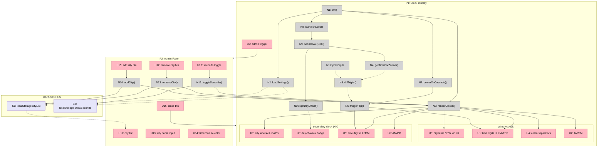

# Tock — Shaping

## Source

> I want to build a simple clock web app that shows me the local time in NYC primarily. Below that clock I want several other clocks of the same style for different cities/time zones (Nashville, TN; Los Angeles, CA; Auckland, New Zealand; Tel Aviv, Israel). They should stay current on time, be quick to load and reference those time zones at a glance so I know what time it is for co-workers before I call them. I would like the theme to be dark. I would like the time to flip like an old school airport terminal board. It should have a control to turn the seconds display on the large clock off, but subtly out of the way as to not ruin the interface design. Take note in your execution of the animation detail as the board numbers flip - want to apply the proper physics to replicate the true behavior of this style system IRL.

---

## Frame

### Problem

- Need to quickly check what time it is for co-workers in multiple time zones before connecting with them
- No at-a-glance tool that shows NYC (primary) alongside Nashville, LA, Auckland, and Tel Aviv

### Outcome

- Open a page and immediately see NYC time prominently, with secondary city clocks below
- All clocks stay current in real-time
- The interface feels like a physical split-flap display — not a cartoon imitation

---

## Requirements (R)

| ID | Requirement | Status |
|----|-------------|--------|
| R0 | NYC time displayed prominently as the primary clock | Core goal |
| R1 | Secondary clocks for configurable cities visible below primary (default: Nashville, Los Angeles, Auckland, Tel Aviv) | Core goal |
| R2 | All clocks update in real-time — stay current to the second | Must-have |
| R3 | Dark theme throughout | Must-have |
| R4 | Split-flap / flip-board animation aesthetic (airport terminal style) | Must-have |
| R5 | Flip animation uses physically accurate motion: gravity-driven hinge, acceleration, overshoot, snap settle | Must-have |
| R6 | Seconds display on primary clock can be toggled off via admin area | Must-have |
| R7 | Admin area is hidden from the main clock view — does not disrupt the display | Must-have |
| R8 | Fast to load — minimal dependencies, quick to first render | Must-have |
| R9 | Can add new city/timezone from admin area | Must-have |
| R10 | Can remove a city/timezone from admin area | Must-have |
| R11 | City list persists across page reloads (localStorage) | Must-have |
| R12 | No more than ~6 secondary locations expected at a time | Nice-to-have |
| R13 | 🟡 12-hour format with AM/PM indicator | Must-have |
| R14 | 🟡 Day-of-week shown for cities where the date differs from NYC (e.g., Auckland showing "TUE") | Must-have |
| R15 | 🟡 City labels displayed in ALL CAPS | Must-have |
| R16 | 🟡 Power-on cascade animation on page load/refresh — flaps flip into place as if the board is starting up | Must-have |

---

## A: Split-Flap Clock App (Configurable Cities, Pure CSS/JS)

🟡 Single HTML/CSS/JS app. No framework. Configurable city list stored in localStorage. Split-flap animation built from CSS 3D transforms with physics-tuned easing. Timezone math via `Intl.DateTimeFormat`. Hidden admin panel for managing cities and settings.

| Part | Mechanism | Flag |
|------|-----------|:----:|
| **A1** | 🟡 **Flap digit** — four-layer DOM per character: two static halves (new char top, old char bottom) + two animated flaps. Top flap (old char top half) hinges at bottom edge (`transform-origin: 50% 100%`), rotates `0° → -90°` with `ease-in` timing (gravity acceleration). Bottom flap (new char bottom half) hinges at top edge (`transform-origin: 50% 0%`), rotates `90° → 0°` via multi-stage `@keyframes`: 70% → overshoot -3°, 85% → bounce-back 1.5°, 100% → settle at 0°. Container has `perspective: 300–500px`. Both flaps use `backface-visibility: hidden`. Hinge gap is 2px dark line. Cast shadow animates on bottom-static during flip. Duration ~300ms, bottom flap delayed 40–50%. See `spike-flip-physics.md`. | |
| **A2** | 🟡 **Clock assembly** — groups flap digits into `HH : MM (: SS)` in 12-hour format. AM/PM indicator rendered as a smaller flap pair or static label beside the time. Colon separators styled as fixed flap cards. Each assembly takes a `timeZone` string (IANA) and a `showSeconds` boolean. Uses `Intl.DateTimeFormat` with `hour12: true` and `timeZone` option to derive current h/m/s/period. Registers a tick callback (see A5) that updates only the digits that changed. | |
| **A3** | 🟡 **Primary NYC display** — large clock assembly (`timeZone: 'America/New_York'`), city label "NEW YORK" in ALL CAPS above or below in a terminal-style font. | |
| **A4** | 🟡 **Secondary clocks row** — smaller clock assemblies in a row/grid below primary, rendered from a dynamic city list. Each shows ALL CAPS city label + time (no seconds). Cities whose current date differs from NYC show a day-of-week abbreviation (e.g., "TUE") next to the city label. Day offset computed by comparing `Intl.DateTimeFormat` weekday for the city vs NYC each tick. Default cities: Nashville `America/Chicago`, Los Angeles `America/Los_Angeles`, Auckland `Pacific/Auckland`, Tel Aviv `Asia/Jerusalem`. List is read from localStorage on load; falls back to defaults if empty. | |
| **A5** | **Tick loop** — single `setInterval(1000)` drives all clock assemblies. Each tick, every assembly reads current time for its timezone via `Intl.DateTimeFormat`, diffs against previous digits, and triggers flap animations only on changed digits. No per-clock timers. | |
| **A6** | **Dark shell** — dark background (`#1a1a1a` or similar), minimal page chrome, monospace/terminal font (e.g., system mono or a web-safe equivalent to keep load fast). Layout: primary clock centered top, secondary clocks row centered below with even spacing. Responsive: stacks vertically on narrow screens. | |
| **A7** | **Admin panel** — hidden drawer/overlay toggled by a subtle trigger (e.g., gear icon in corner, or tap a hidden hotspot). Contains: (1) seconds toggle for primary clock, (2) city list with remove buttons, (3) add-city input (city name + IANA timezone picker or autocomplete). Changes persist to localStorage immediately. Panel slides in/out without disrupting clock layout. | |
| **A8** | 🟡 **Power-on cascade** — on page load/refresh, all flap digits start blank and flip into their current values with a staggered delay (left-to-right, primary clock first, then secondary clocks). Each digit triggers its flip animation with a 30–80ms offset from the previous, simulating a Solari board powering on. Runs once on init, then normal tick loop takes over. | |

---

## Fit Check (R × A)

| Req | Requirement | Status | A |
|-----|-------------|--------|---|
| R0 | NYC time displayed prominently as the primary clock | Core goal | ✅ |
| R1 | Secondary clocks for configurable cities visible below primary (default: Nashville, Los Angeles, Auckland, Tel Aviv) | Core goal | ✅ |
| R2 | All clocks update in real-time — stay current to the second | Must-have | ✅ |
| R3 | Dark theme throughout | Must-have | ✅ |
| R4 | Split-flap / flip-board animation aesthetic (airport terminal style) | Must-have | ✅ |
| R5 | Flip animation uses physically accurate motion: gravity-driven hinge, acceleration, overshoot, snap settle | Must-have | ✅ |
| R6 | Seconds display on primary clock can be toggled off via admin area | Must-have | ✅ |
| R7 | Admin area is hidden from the main clock view — does not disrupt the display | Must-have | ✅ |
| R8 | Fast to load — minimal dependencies, quick to first render | Must-have | ✅ |
| R9 | Can add new city/timezone from admin area | Must-have | ✅ |
| R10 | Can remove a city/timezone from admin area | Must-have | ✅ |
| R11 | City list persists across page reloads (localStorage) | Must-have | ✅ |
| R12 | No more than ~6 secondary locations expected at a time | Nice-to-have | ✅ |
| R13 | 🟡 12-hour format with AM/PM indicator | Must-have | ✅ |
| R14 | 🟡 Day-of-week shown for cities where the date differs from NYC (e.g., Auckland showing "TUE") | Must-have | ✅ |
| R15 | 🟡 City labels displayed in ALL CAPS | Must-have | ✅ |
| R16 | 🟡 Power-on cascade animation on page load/refresh — flaps flip into place as if the board is starting up | Must-have | ✅ |

**Notes:**
- R5 resolved via A1 spike. See `spike-flip-physics.md`.
- R6, R7, R9, R10 satisfied by A7 (admin panel).
- R11 satisfied by A4 reading from localStorage + A7 writing to it.
- R12 is a soft constraint — layout in A4 handles up to ~6 naturally in a row/grid.
- 🟡 R13 satisfied by A2 (clock assembly uses `hour12: true`, renders AM/PM flap pair).
- 🟡 R14 satisfied by A4 (compares weekday of city vs NYC, shows day abbreviation when different).
- 🟡 R15 satisfied by A3 and A4 (ALL CAPS city labels).
- 🟡 R16 satisfied by A8 (power-on cascade with staggered flap init).

---

## Coverage Check (A × R)

Parts as rows, requirements as columns. Shows which parts satisfy which requirements.

| Part | R0 | R1 | R2 | R3 | R4 | R5 | R6 | R7 | R8 | R9 | R10 | R11 | R12 | R13 | R14 | R15 | R16 |
|------|:-:|:-:|:-:|:-:|:-:|:-:|:-:|:-:|:-:|:-:|:-:|:-:|:-:|:-:|:-:|:-:|:-:|
| **A1** Flap digit | | | | | ✅ | ✅ | | | | | | | | | | | |
| **A2** Clock assembly | | | ✅ | | ✅ | | | | | | | | | ✅ | | | |
| **A3** Primary NYC | ✅ | | | | | | | | | | | | | | | ✅ | |
| **A4** Secondary row | | ✅ | | | | | | | | | | ✅ | ✅ | | ✅ | ✅ | |
| **A5** Tick loop | | | ✅ | | | | | | ✅ | | | | | | | | |
| **A6** Dark shell | | | | ✅ | | | | | ✅ | | | | | | | | |
| **A7** Admin panel | | | | | | | ✅ | ✅ | | ✅ | ✅ | ✅ | | | | | |
| **A8** Power-on cascade | | | | | ✅ | | | | | | | | | | | | ✅ |

---

## Detail A: Breadboard

### Places

| # | Place | Description |
|---|-------|-------------|
| P1 | Clock Display | Main view — primary NYC clock centered top, secondary city clocks below |
| P2 | Admin Panel | Hidden overlay/drawer — seconds toggle, city management |

### UI Affordances

| # | Place | Component | Affordance | Control | Wires Out | Returns To |
|---|-------|-----------|------------|---------|-----------|------------|
| U1 | P1 | primary-clock | time digits (HH:MM:SS) | render | — | — |
| U2 | P1 | primary-clock | AM/PM flap pair | render | — | — |
| U3 | P1 | primary-clock | city label "NEW YORK" | render | — | — |
| U4 | P1 | primary-clock | colon separators | render | — | — |
| U5 | P1 | secondary-clock | time digits (HH:MM) | render | — | — |
| U6 | P1 | secondary-clock | AM/PM flap pair | render | — | — |
| U7 | P1 | secondary-clock | city label (ALL CAPS) | render | — | — |
| U8 | P1 | secondary-clock | day-of-week badge (e.g., "TUE") | render | — | — |
| U9 | P1 | shell | admin trigger (gear icon, corner) | click | → P2 | — |
| U10 | P2 | admin-panel | seconds toggle switch | click | → N12 | — |
| U11 | P2 | admin-panel | city list (existing cities) | render | — | — |
| U12 | P2 | admin-panel | remove city button (per row) | click | → N13 | — |
| U13 | P2 | admin-panel | city name input | type | — | — |
| U14 | P2 | admin-panel | timezone selector | select | — | — |
| U15 | P2 | admin-panel | add city button | click | → N14 | — |
| U16 | P2 | admin-panel | close button | click | → P1 | — |

### Code Affordances

| # | Place | Component | Affordance | Control | Wires Out | Returns To |
|---|-------|-----------|------------|---------|-----------|------------|
| N1 | P1 | app | `init()` | call | → N2, → N3, → N7, → N8 | — |
| N2 | P1 | app | `loadSettings()` | call | — | → S1, → S2 |
| N3 | P1 | app | `renderClocks()` | call | → U1, → U2, → U3, → U4, → U5, → U6, → U7 | — |
| N4 | P1 | clock-assembly | `getTimeForZone(tz)` | call | — | → N5 |
| N5 | P1 | clock-assembly | `diffDigits(prev, current)` | call | → N6 | — |
| N6 | P1 | flap-digit | `triggerFlip(el, old, new)` | call | → U1, → U5 | — |
| N7 | P1 | app | `powerOnCascade()` | call | → N6 | — |
| N8 | P1 | app | `startTickLoop()` | call | → N9 | — |
| N9 | P1 | tick-loop | `setInterval(1000)` | timer | → N4, → N10 | — |
| N10 | P1 | secondary-clock | `getDayOffset(cityTz)` | call | — | → U8 |
| N11 | P1 | clock-assembly | `prevDigits` | store | — | → N5 |
| N12 | P2 | admin-panel | `toggleSeconds(bool)` | call | → S2, → N3 | — |
| N13 | P2 | admin-panel | `removeCity(index)` | call | → S1, → N3 | — |
| N14 | P2 | admin-panel | `addCity(name, tz)` | call | → S1, → N3 | — |

### Data Stores

| # | Place | Store | Description |
|---|-------|-------|-------------|
| S1 | P1 | `localStorage:cityList` | Array of `{name, timezone}` — persists across reloads. Defaults: Nashville, LA, Auckland, Tel Aviv |
| S2 | P1 | `localStorage:showSeconds` | Boolean — persists across reloads. Default: true |

### Wiring Narrative

**Init flow (page load):**
N1 `init()` → N2 `loadSettings()` reads S1 + S2 → N3 `renderClocks()` builds DOM for primary + all secondary clocks → N7 `powerOnCascade()` stagger-flips all digits from blank with 30–80ms offsets → N8 `startTickLoop()` begins the interval.

**Tick flow (every second):**
N9 `setInterval` fires → for each clock: N4 `getTimeForZone(tz)` returns `{h, m, s, period, weekday}` → N5 `diffDigits()` compares against N11 `prevDigits` → for each changed digit: N6 `triggerFlip()` runs CSS animation → updates U1 or U5. For secondary clocks: N10 `getDayOffset()` compares city weekday vs NYC → updates U8 if different.

**Admin — toggle seconds:**
U10 click → N12 `toggleSeconds()` → writes S2, calls N3 `renderClocks()` to show/hide seconds flaps on primary.

**Admin — remove city:**
U12 click → N13 `removeCity()` → writes S1, calls N3 `renderClocks()` to rebuild secondary row.

**Admin — add city:**
U13 type name, U14 select timezone, U15 click → N14 `addCity()` → writes S1, calls N3 `renderClocks()` to rebuild secondary row.

### Breadboard Diagram

**Legend:**
- **Pink nodes (U)** = UI affordances (things users see/interact with)
- **Grey nodes (N)** = Code affordances (methods, stores, timers)
- **Lavender nodes (S)** = Data stores (localStorage)
- **Solid lines** = Wires Out (calls, triggers, writes)
- **Dashed lines** = Returns To (reads, return values)
